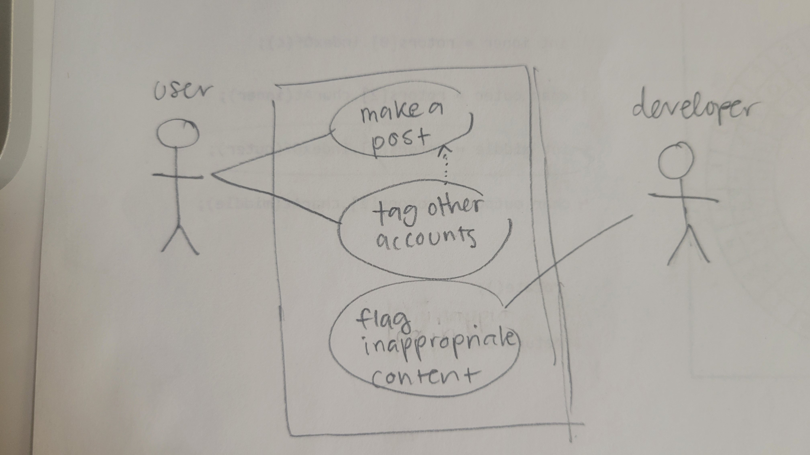

1. A functional requirement deals with specific functionality; what the system should be able to DO. A non-functional requirement deals with speed, operability, availability, safety, integrity, usability, etc -- HOW a system should perform.
2. 1- should allow user to "like" posts. 2- should allow user to send a message to another user
3. 1- caption font color should be black 2- profanity should be flagged
4. 
5. Because clients don't necessarily know what they want before it's being built. It's a more dynamic way of iterating through requirements using prototyping and it allows for more flexibility than going through the requirements one at a time.
6. 
